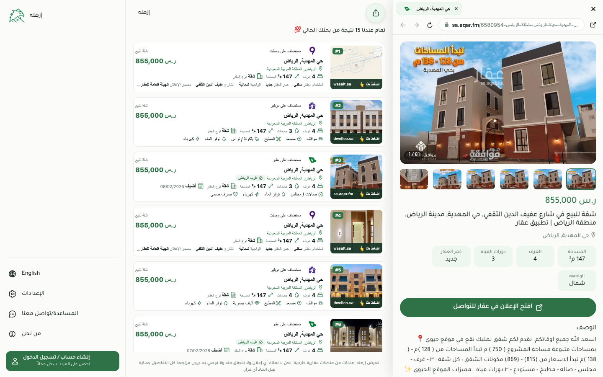
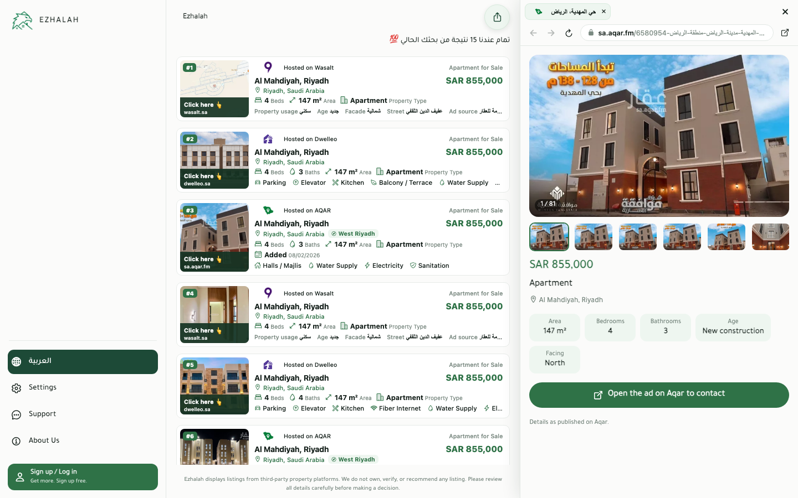
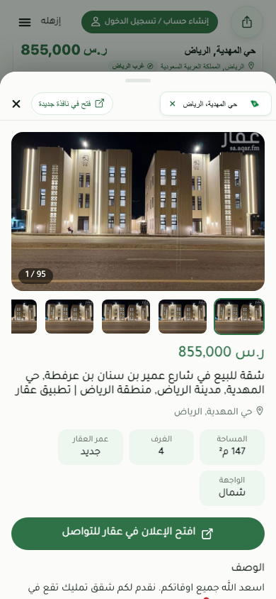
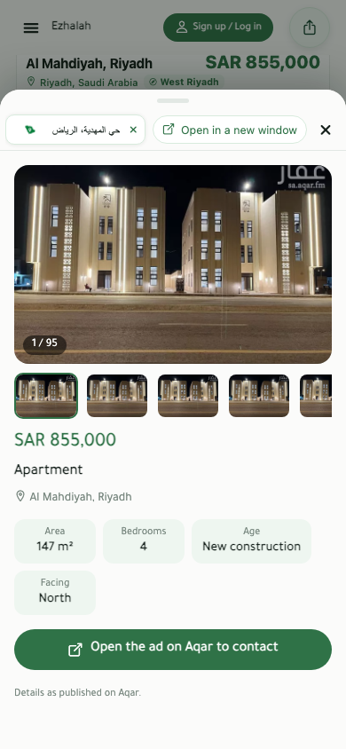
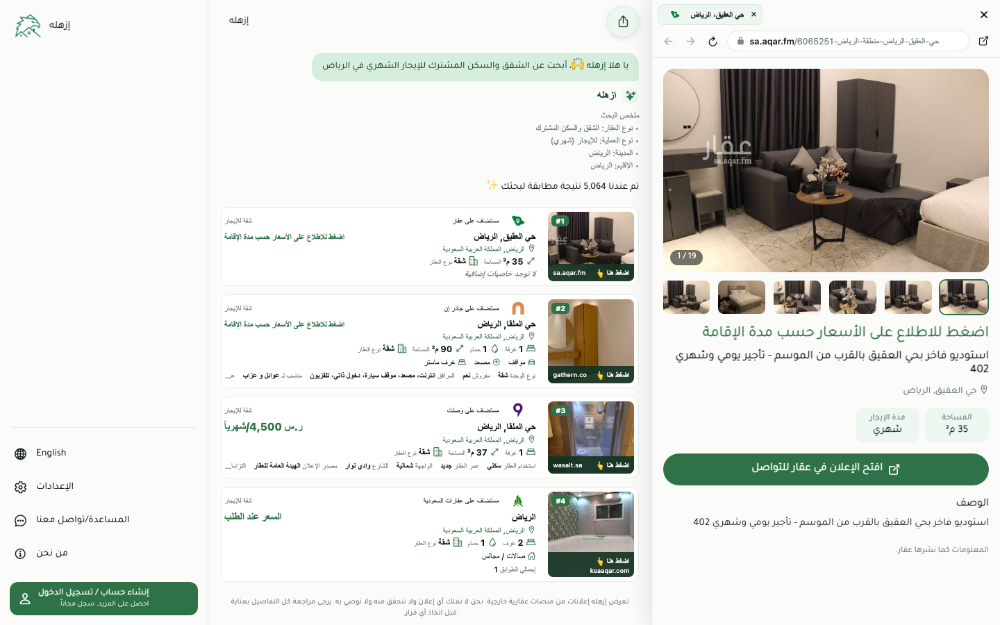
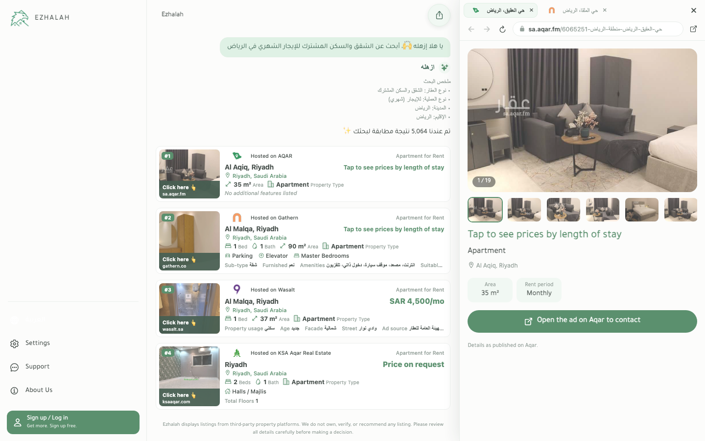

# Aqar preview verification

Tested against the local web export and real production listing reads. This branch has **not been
merged or deployed**; production verification belongs to the owner's subsequent deployment.

## Customer journey

1. Open the Filter screen; dismiss optional consent with **الضروري فقط** when shown.
2. Select **شراء**, type/select **الرياض**, then type **المهدية** and select **حي المهدية**.
3. Select **سكني**, **الشقق والسكن المشترك**, and **4** bedrooms.
4. Enter area **147–147** and price **855000–855000**, then **بحث بهذه الخيارات**.
5. Open an Aqar card. The live search returned **15** matches during verification (inventory changes).
6. Select the second thumbnail, reload, click the contact button, open the same card again, hide the
   desktop panel, and reopen it with another card click. Close an individual tab.
7. Switch the sidebar language to English and repeat the preview checks.

Desktop **1440×900** and touch-enabled phone **390×844** both passed in Arabic and English:

- Aqar opens in the existing panel/sheet without a new browser tab or iframe. The only additional
  REST request on opening was the existing click tracking; no listing-data fetch was made.
- Price **855,000**, area **147 m²**, bedrooms **4**, and north-facing facts matched the selected card.
  Missing bathrooms were absent on one listing; a second listing with three bathrooms showed three.
- A real **95-photo** listing retained all photos in source order. All 95 thumbnails had lazy
  loading; 26 of the 96 image elements had loaded while the remaining offscreen photos were deferred.
  Main-image priority was high. Thumbnail selection changed the counter; reload reset it to 1.
- The contact button opened the original Aqar URL with `window.opener === null`. Desktop back and
  forward stayed disabled. Repeated clicks produced separate tabs; hide/reopen preserved desktop
  tabs, and individual close removed just one. The existing phone close behaviour is unchanged.
- Phone sheet height was **743 px** (88% of 844), with no horizontal page overflow. Preview text
  used the actually loaded Tajawal token in both locales; no fallback font was used.
- English preview labels/facts were translated, and Arabic title/description prose was hidden.

## Other sources

A separate real **إيجار → شهري → الرياض → سكني → الشقق والسكن المشترك** search verified:

- Aqar Monthly displays **اضغط للاطلاع على الأسعار حسب مدة الإقامة**, and the corresponding English
  stay-length note, instead of a numeric price.
- A Gathern card still opens its real site in an iframe; the source document rendered successfully.
- Switching between the Monthly preview and Gathern frame keeps the original tab behaviour.

## Regression checks

- `npm test`: **576/576 checks passed** (393 seconds), including the requested allowlist, prose,
  input-font, conversation-state and source-window guards.
- `npx tsc --noEmit`: clean.
- Focused allowlist and prose guards rerun after the final display edits: passed.
- Browser assertions on the final export: desktop AR/EN and phone AR/EN passed, zero uncaught errors.
- `git diff --check`: clean.

The first browser run exposed numeric `property_age` despite its string TypeScript type. The
preview now accepts either raw shape. The barrier executes the actual facts block with numeric,
string and missing fields, and catches a mutation restoring the crashing `.trim()` call. Existing
viewer checks remain intact; additional mutations cover preview routing, iframe exclusion, shared
pricing, English prose hiding, opener protection, missing facts and lazy thumbnails.

## Screenshots

| Desktop Arabic | Desktop English |
| --- | --- |
|  |  |

| Phone Arabic | Phone English |
| --- | --- |
|  |  |

| Monthly Arabic | Monthly English |
| --- | --- |
|  |  |
